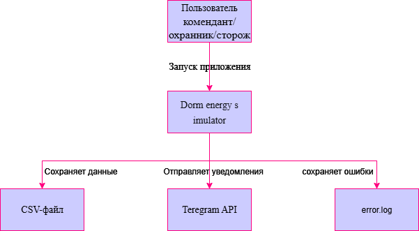
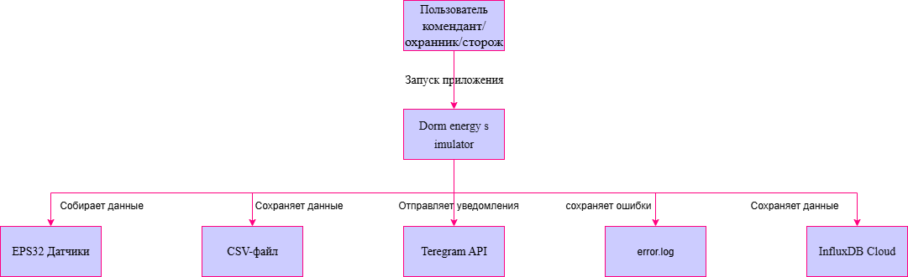
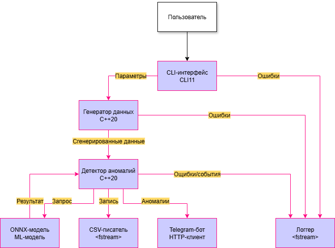
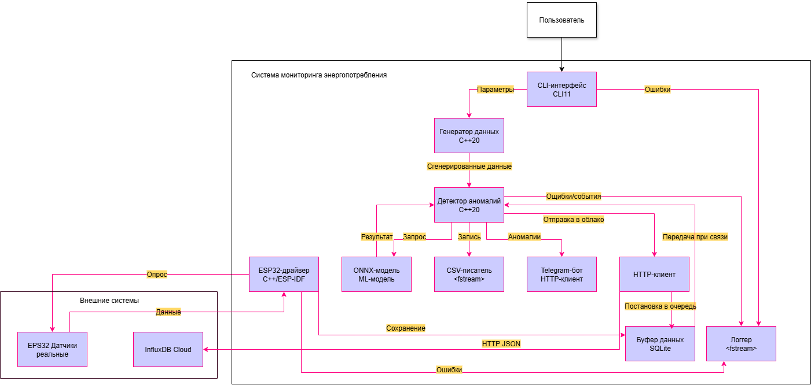

# Архитектура системы
Модель C4 (от англ. С4 model, Context Container Component Code model, модель «контекст-контейнер-компонент-код») — простой метод графической записи для моделирования архитектуры программных систем[1]. Он основан на структурной декомпозиции системы на контейнеры и компоненты и опирается на существующие методы моделирования, такие как Unified Modeling Language (UML) или ER-модель (ERD), для более детальной декомпозиции архитектурных блоков.

Модель C4 описывает архитектуру программных систем, отражая ее с разных точек зрения, объясняющих декомпозицию системы на контейнеры и компоненты, а также связи между этими элементами и, там где это уместно, связи между ее пользователями[2].

Диаграммы организованы в соответствии с их иерархическим уровнем:

Диаграммы контекста (уровень 1): показывают систему в масштабе ее взаимодействия с пользователями и другими системами;
Диаграммы контейнеров (уровень 2): разбивают систему на взаимосвязанные контейнеры. Контейнер - это исполняемая и развертываемая подсистема;
Диаграммы компонентов (уровень 3): разделяют контейнеры на взаимосвязанные компоненты и отражают связи компонент с другими контейнерами или другими системами;
Диаграммы кода (уровень 4): предоставляют дополнительные сведения о дизайне архитектурных элементов, которые могут быть сопоставлены с программным кодом. Модель C4 на этом уровне опирается на существующие нотации, такие как UML, диаграммы отношений сущностей (ERD) или диаграммы, созданные интегрированными средами разработки (IDE).

## 1. Контекст системы (C4 Level 1)

### Текущая версия (0.1)

*Рисунок 1. Контекст системы — текущая версия (симуляция + CSV + Telegram)*

**Взаимодействия:**
- Пользователь запускает приложение с параметрами
- Система сохраняет результаты в CSV-файл
- При аномалиях отправляет уведомления в Telegram
- Все ошибки пишутся в error.log

### Планируемое расширение (версии 1.0+)

*Рисунок 2. Контекст системы — с реальными датчиками и облачным хранением*

**Новые взаимодействия:**
- ESP32 датчики собирают реальные данные
- Данные сохраняются в InfluxDB Cloud
- CSV остаётся для локального архива

## 2. Контейнеры (C4 Level 2)

### Текущая версия (0.1)

*Рисунок 3. Диаграмма контейнеров — текущая версия (симуляция + ML + Telegram)*

**Состав текущей версии:**

| Контейнер             | Назначение                                                     | Технологии        |
|-----------------------|----------------------------------------------------------------|-------------------|
| **CLI-интерфейс**     | Принимает параметры от пользователя                            | CLI11, C++20      |
| **Генератор данных**  | Создает синтетические данные с учетом времени суток и выходных | `<random>`, C++20 |
| **ONNX Runtime**      | Выполняет ML-модель для детекции аномалий                      | ONNX Runtime      |
| **Детектор аномалий** | Координирует проверку (пороги + ML + ночное падение)           | Логика на C++20   |
| **CSV-писатель**      | Сохраняет результаты анализа в файл                            | `<fstream>`       |
| **Telegram-бот**      | Отправляет уведомления при обнаружении аномалий                | HTTP-клиент (C++) |
| **Логгер**            | Записывает ошибки и события в `error.log`                      | `<fstream>`       |

**Взаимодействия между контейнерами:**

1. **CLI-интерфейс → Генератор данных**: передает параметры 
2. **Генератор данных → Детектор аномалий**: передает сгенерированные данные
3. **Детектор аномалий → ONNX Runtime**: запрос на ML-инференс
4. **ONNX Runtime → Детектор аномалий**: результат ML (аномалия да/нет)
5. **Детектор аномалий → CSV-писатель**: запись результатов
6. **Детектор аномалий → Telegram-бот**: отправка уведомлений
7. **Все контейнеры → Логгер**: запись ошибок и событий

### Планируемое расширение (версии 1.0+)

*Рисунок 4. Диаграмма контейнеров — с реальными датчиками и облаком*

**Новые контейнеры:**

| Контейнер         | Назначение                             | Технологии |
|-------------------|----------------------------------------|------------|
| **ESP32-драйвер** | Опрос реальных датчиков и сбор данных  | C++/ESP-IDF |
| **Буфер данных**  | Локальное хранение при отсутствии сети | SQLite      |
| **HTTP-клиент**   | Отправка данных в облачное хранилище   | libcurl     |

**Ключевые особенности будущей архитектуры:**

1. **Два источника данных**:
   - Генератор данных (для тестирования и отладки)
   - ESP32-драйвер с реальными датчиками

2. **Буферизация**:
   - При отсутствии интернета данные сохраняются в SQLite
   - При восстановлении связи буфер автоматически отправляется

3. **Централизованное логирование**:
   - Все компоненты пишут в общий логгер
   - Ошибки ESP32 и HTTP также логируются

4. **Интеграция с облаком**:
   - Данные отправляются в InfluxDB Cloud через HTTP-клиент
   - Сохраняются теги: комната, этаж, тип датчика

### Планы на версию 2.0 (режим реального времени)

В версии 2.0 планируется добавить:
- **Автоматический режим** — постоянная работа программы
- **Планировщик задач** — анализ каждую минуту
- **Сборщик статистики** — агрегация данных (среднее, пики, тренды)
- **Grafana** — визуализация дашбордов
- **Автозапуск** при старте системы

## 3. Компоненты (C4 Level 3)

## 4. Потоки данных

## 5. Ключевые архитектурные решения
